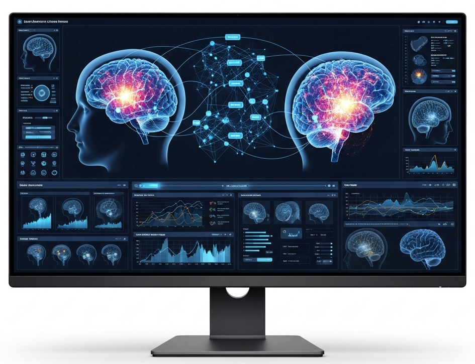

# NeuroVis Graph Gallery

We aim to build a community‑driven hub of scriptable neuroimaging visualizations (initially in Python). It will feature example scripts organized by visualization type (via a simple taxonomy), so you can quickly find exactly what you need. Think of it as a [**Python Graph Gallery**](https://python-graph-gallery.com/) for brain data: intuitive, code‑ready, and powered by the community. Down the road, we hope to welcome contributions in other popular languages like R and MATLAB, too.

Have a favorite tool or snippet? Pull requests and suggestions are more than welcome!
